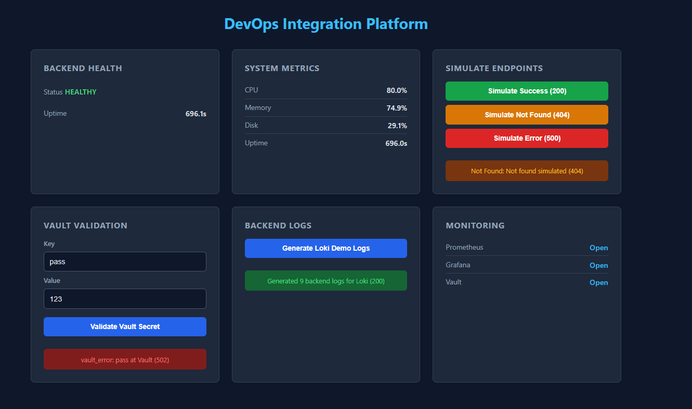
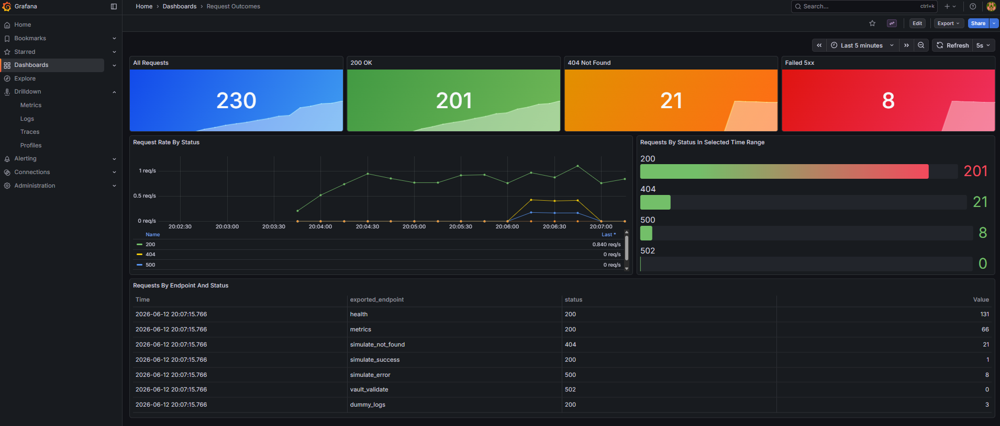
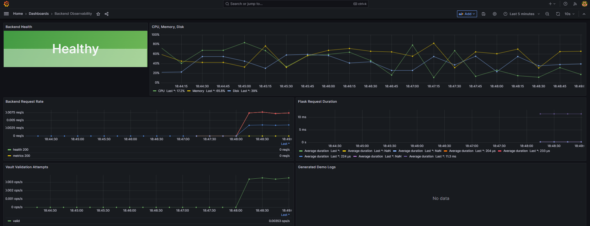
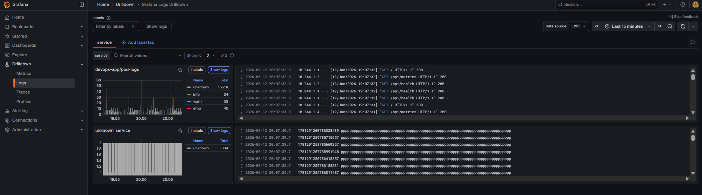
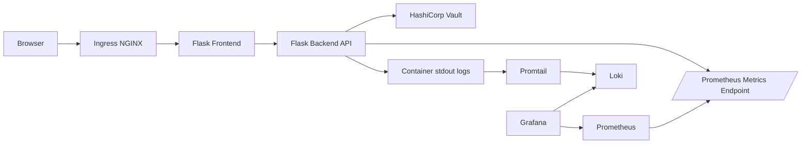

# DevOps Integration Platform

A production-style local DevOps platform that demonstrates a full application and observability workflow on a developer machine. The project combines a Flask frontend, a Flask backend API, Docker, Kubernetes on Kind, Terraform, Helm, Vault, Prometheus, Grafana, Loki, Promtail, and Ingress NGINX into one portfolio-ready environment.

The application exposes a dashboard for backend health, synthetic system metrics, request outcome simulation, Vault secret validation, and Loki log generation. The infrastructure code can deploy the same application into a local Kubernetes cluster with monitoring, logging, ingress, and secrets tooling wired together.



## Highlights

- Flask frontend dashboard with Jinja2 templates, CSS, and browser-side JavaScript.
- Flask backend API with health, metrics, Vault validation, simulated HTTP outcomes, and demo log generation endpoints.
- Prometheus metrics exported through `prometheus_flask_exporter` plus custom counters and gauges.
- Grafana dashboards for backend observability and request outcomes.
- Loki and Promtail based log aggregation for backend application logs.
- HashiCorp Vault dev deployment used by the app to validate a secret value.
- Docker Compose flow for quick local development.
- Terraform flow that creates a Kind cluster, installs Helm charts, builds the app image, and deploys the app to Kubernetes.
- Ingress NGINX routing for browser access to the Kubernetes-hosted frontend.

## Screenshots

### Metrics Dashboard





### Logs Dashboard



## Technology Stack

| Area | Technologies |
| --- | --- |
| Backend | Python 3.11, Flask, Requests, Prometheus Python client, `prometheus_flask_exporter` |
| Frontend | Flask, Jinja2 templates, HTML, CSS, JavaScript |
| Containers | Docker, Docker Compose |
| Kubernetes | Kind, Kubernetes Deployments, Services, ConfigMaps, Secrets, Ingress |
| Infrastructure as Code | Terraform, Helm provider, Kubernetes provider, local-exec provisioning |
| Ingress | ingress-nginx Helm chart |
| Secrets | HashiCorp Vault Helm chart in local dev mode |
| Metrics | Prometheus, kube-prometheus-stack, custom Flask metrics |
| Dashboards | Grafana, provisioned datasources, provisioned JSON dashboards |
| Logs | Grafana Loki, Promtail, structured JSON application logs |

## Architecture



## Repository Layout

```text
.
|-- backend/                         # Flask backend API and Prometheus metrics
|-- frontend/                        # Flask UI, templates, CSS, and JavaScript
|-- images/                          # README screenshots
|-- infrastructure/                  # Terraform-managed Kind, Helm, and app deployment
|-- kubernetes/                      # Manual Kubernetes and Helm installation scripts
|-- monitoring/                      # Prometheus config and Grafana provisioning
|   `-- grafana/
|       `-- dashboards/              # Backend and request outcome dashboard JSON
|-- Dockerfile                       # Python application image
|-- docker-compose.yml               # Local app, Prometheus, and Grafana stack
|-- requirements.txt                 # Python dependencies
`-- start.sh                         # Starts backend and frontend in one container
```

## Application Features

| Feature | Description |
| --- | --- |
| Backend health | `/api/health` returns service status, timestamp, and uptime. |
| System metrics | `/api/metrics` returns simulated CPU, memory, disk, and uptime values. |
| Prometheus scrape endpoint | `/metrics` exposes default Flask metrics and custom app metrics. |
| Request simulation | `/api/simulate/success`, `/api/simulate/not_found`, and `/api/simulate/error` generate 200, 404, and 500 outcomes. |
| Vault validation | `/api/vault/validate` checks a submitted key/value pair against Vault. |
| Demo log generation | `/api/logs/dummy` emits structured JSON logs with info, warning, and error levels. |

## Observability

Prometheus scrapes the backend on `/metrics`. The backend exports both default Flask request metrics and custom metrics:

- `app_health_status`
- `app_http_requests_total`
- `app_vault_validation_total`
- `app_dummy_logs_total`
- `app_cpu_usage_percent`
- `app_memory_usage_percent`
- `app_disk_usage_percent`

Grafana is provisioned with:

- `Backend Observability`: health, simulated resource usage, request rate, request duration, Vault validation attempts, and generated demo logs.
- `Request Outcomes`: all requests, 200 responses, 404 responses, 5xx responses, request rate by status, and endpoint/status breakdowns.

Loki receives structured application logs through Promtail in the Kubernetes flow. Use the frontend button named `Generate Loki Demo Logs` to create sample log events that can be explored in Grafana.

## Run Locally with Docker Compose

This path is useful for fast application and dashboard development without creating a Kind cluster.

### Prerequisites

- Docker and Docker Compose
- Python 3.11 if you want to run the app directly outside containers
- Optional: Vault CLI or a local Vault dev server for the Vault validation demo

### Start the stack

```bash
docker compose up --build
```

Default local URLs:

| Service | URL |
| --- | --- |
| Frontend | http://localhost:5000 |
| Backend API | http://localhost:5001 |
| Prometheus | http://localhost:9091 |
| Grafana | http://localhost:3001 |
| Vault UI | http://localhost:8200 |

Grafana default login for the Compose stack:

```text
Username: admin
Password: admin
```

### Optional Vault setup for Compose

The Compose stack expects Vault to be reachable from containers at `http://host.docker.internal:8200`. For a local demo, start Vault in dev mode and seed the expected secret:

```bash
vault server -dev -dev-root-token-id=root
```

In another terminal:

```bash
curl --header "X-Vault-Token: root" \
  --request POST \
  --data '{"pass":"123"}' \
  http://127.0.0.1:8200/v1/cubbyhole/asmaa
```

The frontend Vault form defaults to:

```text
Key: pass
Value: 123
```

## Deploy with Terraform and Kind

This path provisions the full Kubernetes-based platform.

### Prerequisites

- Docker
- Terraform 1.5+
- Kind
- kubectl
- Helm

### Provision the platform

```bash
cd infrastructure
terraform init
terraform apply
```

Terraform will:

1. Generate a Kind cluster config.
2. Create the `devops-platform` Kind cluster.
3. Install ingress-nginx, Vault, kube-prometheus-stack, Grafana, Loki, and Promtail with Helm.
4. Build the local `flask-app:latest` Docker image.
5. Load the image into Kind.
6. Deploy frontend and backend workloads into the `devops-app` namespace.
7. Create services, probes, resource limits, and ingress routing.

### Kubernetes URLs

| Service | URL |
| --- | --- |
| App through ingress | http://app.local:8080 |
| App with curl Host header | `curl -H 'Host: app.local' http://localhost:8080/` |
| Grafana | http://localhost:3000 |
| Prometheus | http://localhost:9090 |
| Loki | http://localhost:3100 |
| Vault | http://localhost:8200 |

For browser access to `app.local`, add this entry to your hosts file:

```text
127.0.0.1 app.local
```

### Seed Vault in the Kubernetes flow

After Terraform finishes, seed the same demo secret through the local Vault NodePort:

```bash
curl --header "X-Vault-Token: root" \
  --request POST \
  --data '{"pass":"123"}' \
  http://127.0.0.1:8200/v1/cubbyhole/asmaa
```

### Useful verification commands

```bash
kubectl cluster-info --context kind-devops-platform
kubectl get nodes --context kind-devops-platform
kubectl get pods --all-namespaces --context kind-devops-platform
kubectl get pods -n devops-app --context kind-devops-platform
```

### Destroy the platform

```bash
cd infrastructure
terraform destroy
```

## Manual Kubernetes and Helm Flow

The `kubernetes/` directory contains scripts and Helm values for a manual installation path. Use this when you want to understand or demonstrate the raw Kubernetes and Helm steps separately from Terraform automation.

```bash
cd kubernetes
bash helm-repositories.sh
bash install-phase4.sh
bash verify-phase4.sh
```

See `kubernetes/README.md` for the manual flow details.

## Configuration

Important environment variables:

| Variable | Default | Purpose |
| --- | --- | --- |
| `BACKEND_HOST` | `0.0.0.0` | Backend bind host |
| `BACKEND_PORT` | `5001` | Backend API port |
| `FRONTEND_HOST` | `0.0.0.0` | Frontend bind host |
| `FRONTEND_PORT` | `5000` | Frontend port |
| `BACKEND_URL` | `http://localhost:5001` | Frontend-to-backend API URL |
| `VAULT_ADDR` | `http://localhost:8200` | Vault API address |
| `VAULT_TOKEN` | empty | Vault token used by backend validation |
| `VAULT_SECRET_PATH` | `cubbyhole/asmaa` | Vault secret path read by the backend |
| `PROMETHEUS_URL` | `http://localhost:9090` | Browser-facing Prometheus link |
| `GRAFANA_URL` | `http://localhost:3000` | Browser-facing Grafana link |
| `VAULT_UI_URL` | `VAULT_ADDR` | Browser-facing Vault link |

## Security Notes

This project is designed for local development and portfolio demonstration. The default Vault token, Grafana credentials, permissive local ports, and Vault dev mode are intentionally simple for repeatable local setup. Do not use these defaults for a shared, public, or production environment.

For production-style hardening, replace local dev credentials, pin Helm chart versions, use persistent storage where needed, configure TLS, move secrets into a secure secret-management workflow, and review network exposure.

## Cleanup

For Docker Compose:

```bash
docker compose down
```

For Kind directly:

```bash
kind delete cluster --name devops-platform
```

For Terraform-managed infrastructure:

```bash
cd infrastructure
terraform destroy
```
